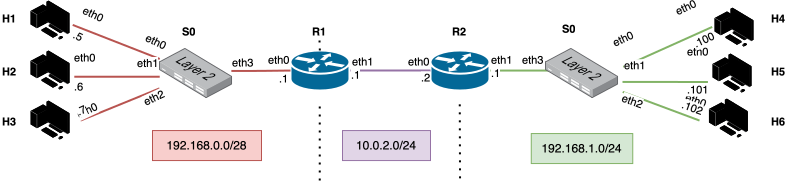
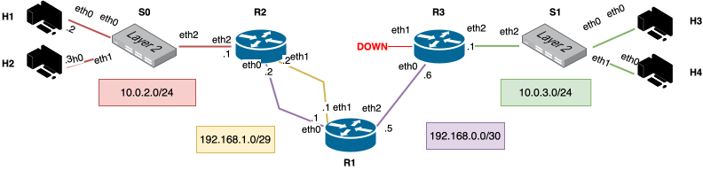
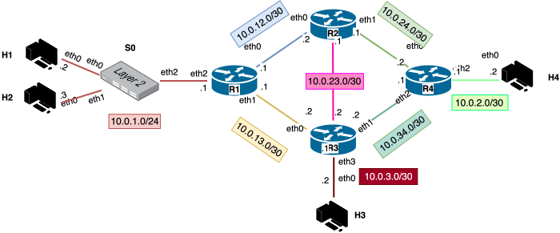
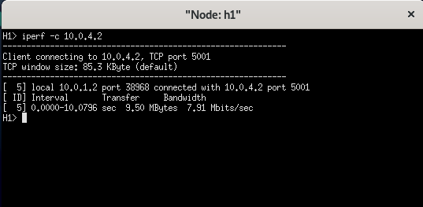
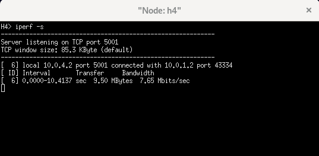
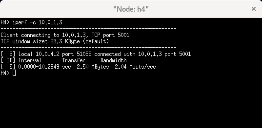
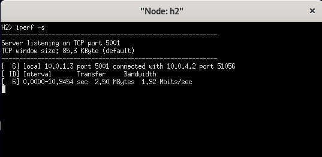
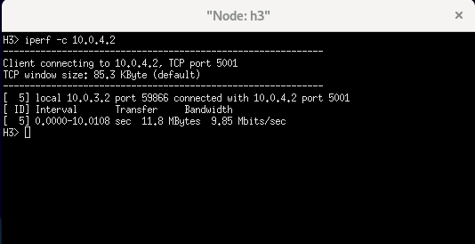
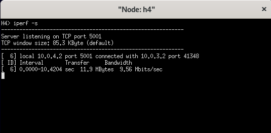

# Mininet-YAML <!-- omit in toc -->

<div style="width: 100%; display: block;">
    <p align="center">
        <picture>
            <source media="(prefers-color-scheme: dark)" srcset="./docs/assets/logo/logo-dark.svg">
            <source media="(prefers-color-scheme: light)" srcset="./docs/assets/logo/logo-light.svg">
            
        </picture>
    </p>
</div>

<p align="center"><strong>🛜 Create and manage virtual networks through simple YAML configuration filess</strong></p>

## Table of Contents <!-- omit in toc -->

- [1. Introduction](#1-introduction)
- [2. Key Features](#2-key-features)
- [3. Getting started](#3-getting-started)
- [4. Tool usage](#4-tool-usage)
- [5. Defining Topologies](#5-defining-topologies)
  - [5.1. Structure of the YAML file](#51-structure-of-the-yaml-file)
    - [5.1.1. Routers](#511-routers)
    - [5.1.2. Hosts](#512-hosts)
    - [5.1.3. Demands (optional)](#513-demands-optional)
  - [5.2. Functionality of Interface Costs](#52-functionality-of-interface-costs)
- [6. Examples](#6-examples)
  - [6.1. Example 1: Simple dumbbell network](#61-example-1-simple-dumbbell-network)
  - [6.2. Example 2: Complex network with multiple routers and hosts](#62-example-2-complex-network-with-multiple-routers-and-hosts)
  - [6.3. Example 3: Complex network with multiple routers, hosts and demands](#63-example-3-complex-network-with-multiple-routers-hosts-and-demands)
- [7. Development environment](#7-development-environment)

## 1. Introduction

Mininet-YAML simplifies the creation of virtual networks via YAML-configured topologies. Users define hosts, routers, and interfaces in a YAML file, deploying complex network topologies within seconds. Integrated with [Mininet](https://mininet.org/) and [Open vSwitch](https://www.openvswitch.org/), it emulates network environments, offering granularity akin to physical hardware.

Additionally, Mininet-YAML enables advanced traffic engineering. Users specify maximum transmission rates between network nodes, triggering automatic adjustments to achieve desired levels. Leveraging a *Mixed Integer Linear Programming* (MILP) model solved by the [CBC Solver](http://www.coin-or.org/Cbc/), it ensures optimal network performance tailored to user specifications.

## 2. Key Features

🚀 **Rapid Network Deployment**:

- Quickly generate and deploy complex virtual network topologies from a simple YAML configuration file.

📈 **Topology Visualization**:

- Automatically generate a visual representation of your network in [Graphviz](https://graphviz.org/) format for easy analysis and sharing.

🌍 **Automated Network Configuration**:

- Seamlessly configure routing tables and propagate them across the network to ensure all nodes can communicate effectively.

🚸 **Advanced Traffic Engineering**:

- Leveraging a MILP model, the tool automatically adjusts link capacities and routing tables to meet specified demands and achieve optimal network performance, maximizing the minimum effective goodput between sources and destinations.

🛠️ **Enhanced Network Interaction**:

- Interact with network elements through a robust CLI, execute custom scripts, and use network diagnostic tools like `ping` and `wireshark` directly within virtual nodes.

🖥️ **Extended Application Support**:

- Support for GUI applications via X11 forwarding, allowing for graphical user interface operations on virtual hosts.

## 3. Getting started

Please, refer to the [Getting Started](./docs/getting-started.md) guide to learn how to install the tool and run your first virtual network.

## 4. Tool usage

Via `emulation.py`, users can either draw the network topology as a graph or create a virtual network leveraging *Mininet*. The tool accepts the following arguments:

```text
usage: emulation.py [-h] [-d] [-l] [-p] [-ld LOG_DIR] [-v] [-s] definition

This tool is able to read a network definition from a YAML file and either draw the network topology as a graph or create a virtual network leveraging Mininet.

positional arguments:
  definition            path to the YAML file containing the network definition

optional arguments:
  -h, --help            show this help message and exit
  -d, --draw            output to stdout the router topology as an undirected graph in Graphviz format
  -l, --lp              output to stdout the network engineering optimization problem in CPLEX format generated from the specified demands in the YAML file
  -p, --print           output to stdout the optimal goodput archievable for each of the flows listed in the demands in the YAML file (if any)
  -ld LOG_DIR, --log-dir LOG_DIR
                        specify the directory where the log file will be saved (default: logs/)
  -v, --verbose         enable verbose logging
  -s, --silent          disable all logging to stdout, except for critical errors
```

## 5. Defining Topologies

Mininet-YAML facilitates virtual network creation via YAML-defined topologies. This configuration allows specifying the high-level network structure, including routers, hosts, interfaces, and optionally, maximum transmission rates between network elements.

### 5.1. Structure of the YAML file

The network topology in the YAML file comprises three main sections: `routers`, `hosts`, and `demands`, each detailed below.

This is an example of a valid YAML network configuration file:

```yaml
routers:
  r1:
    eth0:
      address: 192.168.0.1
      mask: 255.255.255.0
      cost: 10
    eth1:
      address: 10.0.1.5
      mask: 255.255.255.240
  r2:
    eth1:
     address: 10.0.1.1
     mask: 255.255.255.240
     cost: 15
hosts:
   h1:
    eth0:
        address: 
```

#### 5.1.1. Routers

Each router is defined by a name and includes one or more interfaces. Interfaces are detailed with IP addresses, subnet masks, and optionally, costs which influence routing decisions or traffic engineering.

```yaml
routers:
  router_name:
    interface_name:
      address: ipv4_address (i.e. 192.168.0.1)
      mask: subnet_mask  (i.e. 255.255.255.0)
      cost: cost_value  (unsigned integer) # Optional; default is 1
```

#### 5.1.2. Hosts

Similar to routers, each host is defined with a unique name and configured with one or more network interfaces:

```yaml
hosts:
  host_name:
    interface_name:
      address: ipv4_address (i.e. 192.168.0.2)
      mask: subnet_mask (i.e. 255.255.255.0)
```

#### 5.1.3. Demands (optional)

If your topology requires specific traffic **management**, the `demands` section allows you to define maximum transmission rate between couples of network nodes. This section triggers traffic engineering functionalities where the tool adjusts link capacities and routing configurations to meet these demands.

```yaml
demands:
    - source: source_element (router or host name, i.e. "h1")
      destination: destination_element (router or host name, i.e. "r1") 
      rate: maximum_transmission_rate (in Mbps, i.e. 10)
```

### 5.2. Functionality of Interface Costs

The cost assigned to each interface serves different purposes in the tool, depending on the presence of the `demands` section in the YAML file:

1. **Routing Algorithm**: The routing algorithm utilizes the cost to determine the optimal path between nodes. A lower cost generally makes a path more favorable.

2. **Traffic Engineering**: When the `demands` section is included, the cost influences the adjustment of link capacities and routing tables to achieve the optimal effectiveness ratio, integrating a strategic layer to network management.

> **Note**: Absence of the `demands` section defaults the cost utility to only influence routing decisions.

## 6. Examples

In the directory [`examples`](./examples), you can find some YAML files that define different network topologies. You can use them to test the tool and understand how to define your own network. In the following subsections, each example is presented with a graphical representation of the network topology and a brief explanation of the results.

### 6.1. Example 1: Simple dumbbell network

This example defines a simple dumbbell network with two routers and six hosts. The routers are connected to each other, and each host is connected to a router via a switch. This is the topology built by *Mininet-YAML*:

<div style="width: 100%; display: block;">
    <p align="center">
            
        </picture>
    </p>
</div>

> YAML configuration file available in [`examples/dumbell-network-no-cost.yaml`](./examples/dumbell-network-no-cost.yaml)

### 6.2. Example 2: Complex network with multiple routers and hosts

This example defines a more complex network with 3 routers, 4 hosts, and multiple links between them. Each router has 3 interfaces, in which some have a connection. The cost of each link is used by the tool to connect the elements together in the most efficient way, and also to route the traffic between them.

This is the resulting network topology:

<div style="width: 100%; display: block;">
    <p align="center">
            
        </picture>
    </p>
</div>

From the diagram above, it is possible to see that the interface `eth1` of the router `r1` has been kept down as it is not connected to any other interface.

> YAML configuration file available in [`examples/complex-network-multilink-with-costs.yaml`](./examples/complex-network-multilink-with-costs.yaml)

### 6.3. Example 3: Complex network with multiple routers, hosts and demands

In this example, we configure a network comprising 4 routers and 4 hosts, where two hosts are directly connected to the routers, and the remaining two are connected via a switch. We define 3 demands specifying maximum transmission rates between the hosts:

- **Demand 1**: Maximum transmission rate of 10 Mbps between `h1` and `h4`.
- **Demand 2**: Maximum transmission rate of 2 Mbps between `h4` and `h2`.
- **Demand 3**: Maximum transmission rate of 15 Mbps between `h3` and `h4`.

Each link in the topology also has a defined maximum bandwidth, crucial for traffic engineering optimization. Below is the network topology constructed by *Mininet-YAML*:

<div style="width: 100%; display: block;">
    <p align="center">
        
    </p>
</div>

The tool adjusts link capacities and routing tables to meet the specified demands. It computes specific routes for each demand to achieve the desired goodput. In the following subsection is possible to view graphical representation of the optimal routes determined by the *MILP* model for each demand.

Given the constraints of the problem, it is not always feasible to perfectly satisfy all demands. However, the model aims to maximize the minimum effective goodput between the sources and destinations of each demand, ensuring optimal network performance.

Furthermore, to manage this effectively without interfering with other network traffic, packets associated with a specific demand are tagged with a unique identifier. Routers along the path of the demand are equipped with custom routing table entries for these tagged packets, ensuring they are forwarded correctly to the next hop. Packets not associated with a demand follow the standard routing paths established by the tool. This allows to maintain the integrity of the network and prevent interference between different demands.

#### Demand 1 - H1 to H4 <!-- omit in toc -->

<div style="width: 100%; display: block;">
    <p align="center">
            
        </picture>
    </p>
</div>

By running `iperf` between `h1` and `h4`, has been possible to verify the goodput achieved by the tool. The following images show the goodput achieved by the tool for each demand:

<!-- Table with two images side by side -->
<table>
  <tr>
    <td>
      
    </td>
    <td>
      
    </td>
  </tr>
  <tr>
    <td align="center">Source: h1</td>
    <td align="center">Destination: h4</td>
  </tr>
</table>

This path ensures that the goodput from `h1` to `h4` is 8 Mbps rather than the desired 10 (80% effectiveness ratio).

#### Demand 2 - H4 to H2 <!-- omit in toc -->

<div style="width: 100%; display: block;">
    <p align="center">
            
        </picture>
    </p>
</div>

This path ensures that the goodput from `h4` to `h2` is 2 Mbps. The desired goodput is achieved.

The following images show the goodput achieved by `iperf` for each demand:

<!-- Table with two images side by side -->
<table>
  <tr>
    <td>
      
    </td>
    <td>
      
    </td>
  </tr>
  <tr>
    <td align="center">Source: h4</td>
    <td align="center">Destination: h2</td>
  </tr>
</table>

#### Demand 3 - H3 to H4 <!-- omit in toc -->

<div style="width: 100%; display: block;">
    <p align="center">
            
        </picture>
    </p>
</div>

This path ensures that the goodput from `h3` to `h4` is 10 Mbps rather than the desired 15 (66.67% effectiveness ratio).

The following images show the goodput achieved by `iperf` for each demand:

<!-- Table with two images side by side -->
<table>
  <tr>
    <td>
      
    </td>
    <td>
      
    </td>
  </tr>
  <tr>
    <td align="center">Source: h4</td>
    <td align="center">Destination: h2</td>
  </tr>
</table>

The tool has been able to achieve the optimal goodput for this network topology, considering the constraints of the problem. The following table shows the results of the link capacities and the goodput achieved for each demand:

| Demand | Source | Destination | Actual vs desired goodput (Mbps) | Demand Achieved (%) |
| ------ | ------ | ----------- | -------------------------------- | ------------------- |
| 1      | h1     | h4          | 8.0 / 10.0                       | 80.0                |
| 2      | h4     | h2          | 2.0 / 2.0                        | 100.0               |
| 3      | h3     | h4          | 10.0 / 15.0                      | 66.67               |

> YAML configuration file available in [`examples/network-with-demands.yaml`](./examples/network-with-demands.yaml)

## 7. Development environment

To simplify the development process, this repository includes a preconfigured Devcontainer (available in directory [`.devcontainer`](./.devcontainer)) that includes all the necessary tools and dependencies to develop and test the tool.

It follows the open specification of development containers (refer to [Development Containers - Specification](https://containers.dev/implementors/spec/), hence it is supported by Visual Studio Code and other IDEs that support this standard.

> Notes for MacOS users: Unfortunately *Open vSwitch* is not supported in Docker containers on MacOS due to the lack of support for kernel modules. Therefore, to have a fully functional development environment, it is recommended to use Linux. If this is option is not feasible, you can still create a VM with Linux and use the Devcontainer in it.
